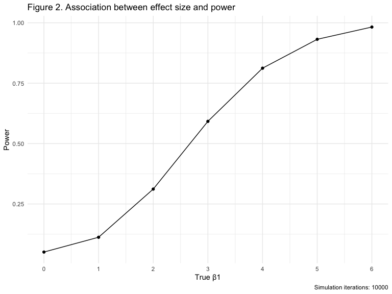
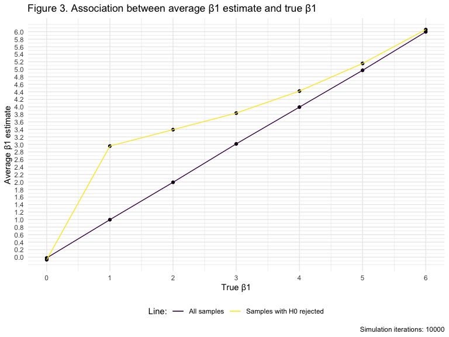

p8105\_hw5\_dz2426
================
Duzhi Zhao
11/2/2019

# Problem 1

``` r
set.seed(10)

iris_with_missing = iris %>% 
  map_df(~replace(.x, sample(1:150, 20), NA)) %>%
  mutate(Species = as.character(Species)) %>% 
  # Clean variable names
  janitor::clean_names()
```

``` r
# Create vector argument x 
x = vector("list", length = 5)

# Create a function "q1_f"
q1_f = function(x) {
  # If input is numeric, replace value with the mean of this column
  if (is.numeric(x)) {
    replace(x, is.na(x), mean(x, na.rm = TRUE))
  } 
  # If input is not numeric, replace value with "virginica"
  else if (!is.numeric(x)) {
    replace(x, is.na(x), "virginica")
  }
}

# Apply q1_f function to each column of dataset
x = map(iris_with_missing, q1_f)

# Updated iris dataset
iris_without_missing = tibble(
  sepal_length = round(x$sepal_length, digits = 1),
  sepal_width = round(x$sepal_width, digits = 1),
  petal_length = round(x$petal_length, digits = 1),
  petal_width = round(x$sepal_width, digits = 1),
  species = x$species
) %>% 
  # Show the first 22 rows which indicate the success of filling NA
  head(22)

knitr::kable(iris_without_missing, caption = "Table 1: First 22 rows of Iris dataset")
```

| sepal\_length | sepal\_width | petal\_length | petal\_width | species   |
| ------------: | -----------: | ------------: | -----------: | :-------- |
|           5.1 |          3.5 |           1.4 |          3.5 | setosa    |
|           4.9 |          3.0 |           1.4 |          3.0 | setosa    |
|           4.7 |          3.2 |           1.3 |          3.2 | setosa    |
|           4.6 |          3.1 |           1.5 |          3.1 | setosa    |
|           5.0 |          3.6 |           1.4 |          3.6 | setosa    |
|           5.4 |          3.9 |           1.7 |          3.9 | setosa    |
|           5.8 |          3.4 |           1.4 |          3.4 | setosa    |
|           5.0 |          3.4 |           1.5 |          3.4 | setosa    |
|           4.4 |          2.9 |           1.4 |          2.9 | setosa    |
|           4.9 |          3.1 |           3.8 |          3.1 | setosa    |
|           5.4 |          3.1 |           1.5 |          3.1 | setosa    |
|           4.8 |          3.4 |           1.6 |          3.4 | setosa    |
|           5.8 |          3.1 |           1.4 |          3.1 | setosa    |
|           4.3 |          3.0 |           3.8 |          3.0 | setosa    |
|           5.8 |          4.0 |           3.8 |          4.0 | setosa    |
|           5.7 |          4.4 |           1.5 |          4.4 | setosa    |
|           5.4 |          3.9 |           1.3 |          3.9 | setosa    |
|           5.1 |          3.5 |           1.4 |          3.5 | setosa    |
|           5.7 |          3.8 |           1.7 |          3.8 | setosa    |
|           5.1 |          3.8 |           1.5 |          3.8 | setosa    |
|           5.4 |          3.4 |           1.7 |          3.4 | setosa    |
|           5.1 |          3.7 |           1.5 |          3.7 | virginica |

Table 1: First 22 rows of Iris dataset

# Problem 2

``` r
# Create a dataframe first including all file names
q2_df = tibble(
  file_names = list.files(path = './data/')
) %>% 
  # Read in data using map function
  mutate(name = map(.x = str_c("./data/", file_names), 
                    ~read_csv(.x))) %>% 
  # Expand dataset completely
  unnest() %>% 
  # Separate variable "file_names" into two variables "group" and "subject id"
  separate(file_names, into = c("group", "subject_id"), sep = "_", remove = F) %>% 
  # Tidy weekly observation data in a pivot_longer format
  pivot_longer(
    week_1:week_8,
    names_to = "week",
    values_to = "observation") %>% 
  # Tidy data
  mutate(week = str_replace(week, "week_", ""),
         file_names = str_replace(file_names, ".csv", ""),
         subject_id = str_replace(subject_id, ".csv", ""),
         group = str_replace(group, "con", "control"),
         group = str_replace(group, "exp", "experimental")
  )
```

``` r
# Spaghetti plot
q2_df %>% 
  ggplot(aes(x = week, y = observation, group = subject_id, color = subject_id)) +
  geom_line() + 
  facet_grid(~group) +
  labs(x = "Week", 
       y = "Observation",
       title = "Figure 1.1 Observations on each subject over time (two-panel)"
    ) +
  scale_color_discrete(name = "Subject ID") +
  theme(strip.text = element_text(size = 12, face = 'bold'))
```


``` r
q2_df %>% 
  ggplot(aes(x = week, y = observation, group = file_names, color = group)) +
  geom_line() + 
  labs(x = "Week", 
       y = "Observation",
       title = "Figure 1.2 Observations on each subject over time (combined)"
    )
```


**Comments:**  
The spaghetti plot shows larger values for subjects in experimental
group compared to those in control group. Furthermore, observations on
experimental subjects indicated a positive trend over time, while
subjects in control group did not show significant difference after 8
weeks.

# Problem 3

``` r
# Create linear model regression function
sim_regression = function(n, beta0 = 2, beta1) {
  
  sim_data = tibble(
    x_i = rnorm(n, mean = 0, sd = 1),
    y_i = beta0 + beta1 * x_i + rnorm(n, 0, sqrt(50)) # standard error term~N[0, sqrt50]
  )
  
  ls_fit = lm(y_i ~ x_i, data = sim_data)
  broom::tidy(ls_fit)
}

# Set beta1 = 0, and generate 10000 datasets from the model
lm_rerun = rerun(10000, sim_regression(n = 30, beta1 = 0)) %>% 
  bind_rows() %>% 
  janitor::clean_names() %>% 
  # select correct p_value
  filter(term == "x_i") %>% 
  select(estimate, p_value)
```

``` r
# Map all 7 beta1 values into the output
sim_result_beta1s = 
  tibble(beta1s = c(0:6)) %>% 
  mutate(
    output_list = map(.x = beta1s, ~rerun(10000, sim_regression(n = 30, beta1 = .x))), 
    output_df = map(output_list, bind_rows)
  ) %>% 
  select(-output_list) %>% 
  unnest(output_df) %>% 
  janitor::clean_names() %>% 
  filter(term == "x_i") %>% 
  select(beta1s, term, estimate, p_value)
```

``` r
q3_plot1 = sim_result_beta1s %>% 
  group_by(beta1s) %>% 
  # Count the number of cases when the null test was rejected or not
  count(p_value < 0.05) %>% 
  janitor::clean_names() %>%
  mutate(proportion = n/sum(n)) %>% 
  # Show only the proportion of times when null was rejected under each beta1
  filter(p_value_0_05 == "TRUE")

q3_plot1 %>% 
  ggplot(aes(x = beta1s, y = proportion)) + 
  geom_point() +
  geom_line() +
  scale_x_continuous(breaks = seq(0, 6, by = 1)) +
  labs(
    x = "True β1", y = "Power", 
    title = "Figure 2. Association between effect size and power",
    caption = "Simulation iterations: 10000"
  )
```



**Comments:**  
The plot shows a positive association between the power of test and
effect size. The power of detecting false null hypothesis increases as
the effect size increases.

``` r
q3_plot2 = sim_result_beta1s %>% 
  group_by(beta1s) %>% 
  # Calculate average estimate for each beta1
  mutate(mean_beta1_hat = mean(estimate)) %>% 
  select(beta1s, mean_beta1_hat) %>% 
  # Remove duplicated rows
  distinct()
```

``` r
q3_plot3 = sim_result_beta1s %>% 
  group_by(beta1s) %>% 
  # Select samples for which H0 was rejected
  filter(p_value < 0.05) %>% 
  mutate(mean_beta1_hat = mean(estimate)) %>% 
  select(beta1s, mean_beta1_hat) %>% 
  distinct()

# Combine two graphs on the sample plot
ggplot(q3_plot2, aes(x = beta1s)) +
  geom_point(data = q3_plot2, aes(y = mean_beta1_hat)) +
  geom_point(data = q3_plot3, aes(y = mean_beta1_hat)) +
  geom_line(data = q3_plot2, aes(y = mean_beta1_hat, color = 'All samples')) +
  geom_line(data = q3_plot3, aes(y = mean_beta1_hat, color = 'Samples with H0 rejected')) +
  scale_x_continuous(breaks = seq(0, 6, by = 1)) +
  scale_y_continuous(breaks = seq(0, 6, by = 0.2)) + 
  labs(
    x = "True β1", y = "Average β1 estimate", 
    title = "Figure 3. Association between average β1 estimate and true β1",
    caption = "Simulation iterations: 10000"
  ) +
  scale_colour_discrete(name = "Line:")
```



**Comments:** The sample average of beta1 estimate across tests for
which the null is rejected is approaching the true beta1 value as beta1
increases.  
At small beta1 value, the power of detecting false H0 is small and the
average beta1 estimate has small sample sizes of which p-value\<0.05.
Thus, it has a larger deviation between average beta1 estimate and true
beta1. As effect size increases, the power of detecting false H0
increases and the average beta1 estimate has larger sample sizes of
which p-value \< 0.05. Therefore, the estimate is approximately true
beta1 when beta1 = 6.
